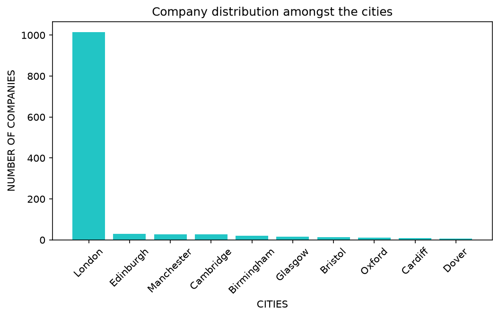
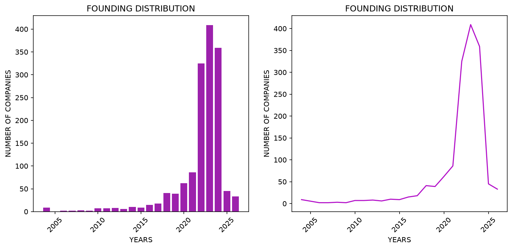
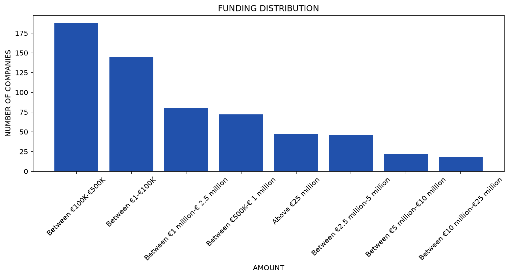

# UK Startups — Data Cleaning & Visualization

A data cleaning and exploratory analysis project on 1,500 UK-based startups, scraped from
[EU-Startups](https://www.eu-startups.com/directory/) with a scraper I built myself
([eu-startups-lead-scraper](https://github.com/leonangheluta-cyber/eu-startups-lead-scraper)).
This project focuses on the next step of the pipeline: taking the raw scraped data and turning
it into something clean, consistent, and ready to analyze.

## Files

- `Cleaning_1500_uk_startups.ipynb` — full cleaning and visualization pipeline
- `samples_data.xlsx` — small sample of the dataset (~25 rows), for reference. The full raw
  and cleaned datasets (1,500 rows) aren't included in this repo to avoid redistributing the
  full scraped content
- `requirements.txt` — dependencies needed to run the notebook
- `images/` — exported charts

## What this project does

**Deduplication**
- Removed exact duplicate company entries (same `Name`), manually verified that no meaningful
  information was lost by keeping the first occurrence
- Investigated a separate case of two different companies sharing an identical `Description`
  (e.g. "FLUX AI" / "FLUX.1 AI", "Vectorize" / "Vectorize io"). Checked the parent company
  website linked on each listing and confirmed these are the same real company listed twice
  under slightly different names on the source site. Since the names differ, these rows were
  **not** dropped automatically — deciding which entry to keep would require manual judgment,
  so both were left in place with a note.

**Standardizing the `Based in` column**
- Normalized casing (`title()` instead of `capitalize()`, to correctly handle multi-word city
  names)
- Split compound values like `"Birmingham, England, United Kingdom"` down to just the city
- Fixed spelling inconsistencies found by manually reviewing the full list of unique values
  (e.g. "Scottland" → "Scotland", "St albans" / "St" / "St. albans" → one consistent value,
  "Greater london" / "Greater lonodn" → "London")
- Result: reduced from **205** unique raw values to **184** clean city values
- Flagged rows where the company only listed a country/region instead of an actual city (e.g.
  "England", "UK", "Scotland") with a `Only county, not city` column, instead of deleting them —
  keeping the data transparent rather than silently discarding it

**Other columns**
- Stripped stray whitespace from `Description`
- Verified `Foundation year` and `Funding` were already consistent (checked, no changes needed)

## Visualizations

Three matplotlib charts built from the cleaned data:

1. **Top 10 cities by number of companies** (bar chart, excluding country/region-only rows)

   

2. **Company foundation years** — bar chart and line chart side by side, comparing yearly counts
   and overall trend

   

3. **Funding ranges distribution** — bar chart of companies that have announced funding,
   excluding "No funding announced yet"

   

## Tech stack

- Python
- pandas — cleaning and analysis
- matplotlib — visualization

## Notes

This is part of a larger personal project — a web scraper written from scratch to extract
startup data from EU-Startups. This notebook picks up where the scraper leaves off, focusing
on realistic, messy real-world data cleaning rather than a synthetic dataset.
